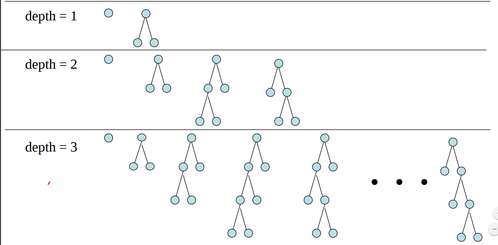

# ***Advanced Game Playing***
> The Below notes is made through my reading from [this](https://www.cs.ubc.ca/~hutter/teaching/cpsc322/2-Search6-final.pdf)

## ***Iterating Deepening***

### Iterative Deepening DFS: Motivation

Want low space complexity but completeness and optimality

Key Idea: re-compute elements of the frontier rather than saving them

|      | Complete     | Optimal     | Time     | Space     |
| :------------- | :------------- | :------------- | :------------- | :------------- |
| ***DFS***       | N (Y if no cycles)       | N       | O(bm)       | O(mb)       |
| ***BFS***       | Y       | Y       | O(bm)       | O(bm)       |
| ***LCFS*** (when arc costs available)       | Y (Costs > 0)       | Y (Costs > 0)       | O(bm)       | O(bm)       |
| ***Best First*** (When h available)     | N       | N       | O(bm)       | O(bm)       |
| ***A**** (when arc costs and 'h' available)       | Y (Costs > 0, h admissible)       | Y (Costs >= 0, h admissible)       | O(bm)       | O(bm)       |

### Iterative Deepening DFS (IDS) in a Nutshell
- Use DFS to look for solutions at depth 1, then 2, then 3, etc
  - For depth D, ignore any paths with longer length
  - Depth-bounded depth-first search

  

#### (Time) Complexity of IDS
- That sounds wasteful!
- Let's analyze the time complexity
- For a solution at depth `m` with branching factor `b`

|  Depth    | Total # of paths at that level     | # times created by BFS (or DFS)    | # times created by IDS     | Total # paths for IDS     |
| :-------------  | :-------------  | :------------- | :------------- | :------------- |
| ***1***         | b       | 1       | m       | mb       |
| ***2***       | b2       | 1      | m-1       | (m-1)b2       |
| ***.***       | .       | .       | .       | .       |
| ***.***       | .       | .       | .       | .       |
| ***.***       | .       | .       | .       | .       |
| ***m - 1***   | bm-1   | 1       | 2       | 2bm-1 |
| ***m*** | bm | 1       | 1       | bm |

|      | Complete     | Optimal     | Time     | Space     |
| :------------- | :------------- | :------------- | :------------- | :------------- |
| ***DFS***       | N (Y if no cycles)       | N       | O(bm)       | O(mb)       |
| ***BFS***       | Y       | Y       | O(bm)       | O(bm)       |
| ***IDS***       | Y       | Y       | O(bm)       | O(mb)       |
| ***LCFS*** (when arc costs available)       | Y (Costs > 0)       | Y (Costs > 0)       | O(bm)       | O(bm)       |
| ***Best First*** (When h available)       | N       | N       | O(bm)       | O(bm)       |
| ***A**** (when arc costs and 'h' available)       | Y (Costs > 0, h admissible)       | Y (Costs >= 0, h admissible)       | O(bm)       | O(bm)       |
