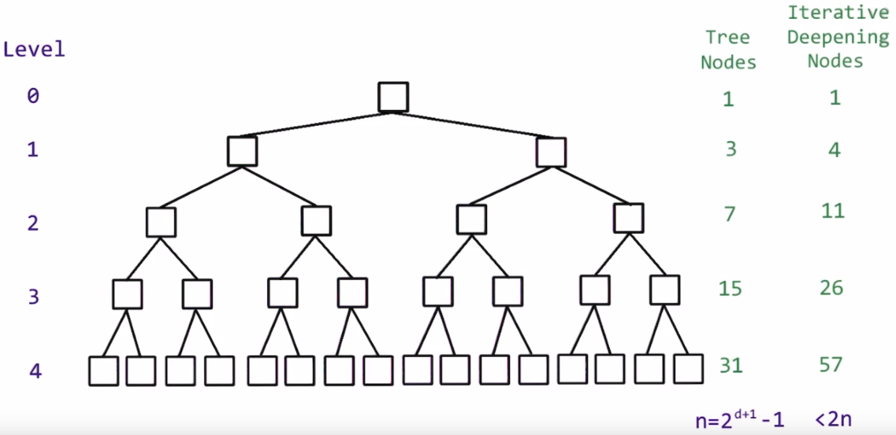
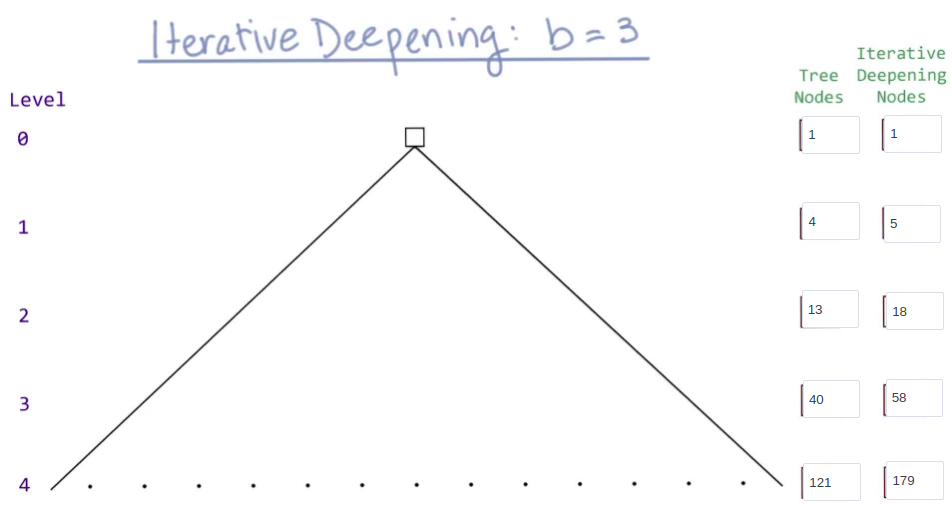

# ***Advanced Game Playing***
> The Below notes is made through my reading from [this](https://www.cs.ubc.ca/~hutter/teaching/cpsc322/2-Search6-final.pdf)

## ***Iterating Deepening***

### Iterative Deepening DFS: Motivation

Want low space complexity but completeness and optimality

Key Idea: re-compute elements of the frontier rather than saving them

|      | Complete     | Optimal     | Time     | Space     |
| :------------- | :------------- | :------------- | :------------- | :------------- |
| ***DFS***       | N (Y if no cycles)       | N       | O(bm)       | O(mb)       |
| ***BFS***       | Y       | Y       | O(bm)       | O(bm)       |
| ***LCFS*** (when arc costs available)       | Y (Costs > 0)       | Y (Costs > 0)       | O(bm)       | O(bm)       |
| ***Best First*** (When h available)     | N       | N       | O(bm)       | O(bm)       |
| ***A**** (when arc costs and 'h' available)       | Y (Costs > 0, h admissible)       | Y (Costs >= 0, h admissible)       | O(bm)       | O(bm)       |

### Iterative Deepening DFS (IDS) in a Nutshell
- Use DFS to look for solutions at depth 1, then 2, then 3, etc
  - For depth D, ignore any paths with longer length
  - Depth-bounded depth-first search

  

#### (Time) Complexity of IDS
- That sounds wasteful!
- Let's analyze the time complexity
- For a solution at depth `m` with branching factor `b`

|  Depth    | Total # of paths at that level     | # times created by BFS (or DFS)    | # times created by IDS     | Total # paths for IDS     |
| :-------------  | :-------------  | :------------- | :------------- | :------------- |
| ***1***         | b       | 1       | m       | mb       |
| ***2***       | b2       | 1      | m-1       | (m-1)b2       |
| ***.***       | .       | .       | .       | .       |
| ***.***       | .       | .       | .       | .       |
| ***.***       | .       | .       | .       | .       |
| ***m - 1***   | bm-1   | 1       | 2       | 2bm-1 |
| ***m*** | bm | 1       | 1       | bm |

|      | Complete     | Optimal     | Time     | Space     |
| :------------- | :------------- | :------------- | :------------- | :------------- |
| ***DFS***       | N (Y if no cycles)       | N       | O(bm)       | O(mb)       |
| ***BFS***       | Y       | Y       | O(bm)       | O(bm)       |
| ***IDS***       | Y       | Y       | O(bm)       | O(mb)       |
| ***LCFS*** (when arc costs available)       | Y (Costs > 0)       | Y (Costs > 0)       | O(bm)       | O(bm)       |
| ***Best First*** (When h available)       | N       | N       | O(bm)       | O(bm)       |
| ***A**** (when arc costs and 'h' available)       | Y (Costs > 0, h admissible)       | Y (Costs >= 0, h admissible)       | O(bm)       | O(bm)       |

### Understanding Exponential Time

*Exponential Timing for a tree with a branching factor of 2*

*Exponential Timing for a tree with a branching factor of 3*

Table for how the above values for the tree with branching factor 3 are obtained

  | Tree Nodes | Iterative Deepening Nodes     |
  | :------------- | :------------- |
  | 1       | 1 + 0 = 1             |
  | 4 (1 + 3)       | 4 + 1 = 5     |
  | 13 (1 + 3 + 9)  | 13 + 5 = 18   |
  | 40 (1 + 3 + 9 + 27)  | 40 + 18 = 58 |
  | 121 (1 + 3 + 9 + 27 + 81)  | 121 + 58 = 179 |

Let us try to extend the same to the trees that have a branching factor of `k` and a depth level of `n`.

Lets us to generalize first the case for a tree with a branching factor of 3

a0 = 1
 
a1 = 3a0 + 1
 
a2 = 3a1 + 1
 
Therefore, an = 3an-1 + 1
 
an = 3an-1 + 1
 
an = 3(3an-2 + 1) + 1
an = 3(3(3an-3 + 1) + 1) + 1
 
.
 
.
 
.
 
.
 
 
an = 3n-1 + 3n-2 + 3n-3 + ..... + 9 + 3  + 1 + 1
 
 
The above summation series is a geometric series with `a` = 3 and `r` = 3
 
 
an = 3n-1 + 3n-2 + 3n-3 + ..... + 9 + 3  + 1 + 1
 
an = 3(3n - 1)/2 + 1
 
an = (3n+1 - 1)/2

 
Similarly, we can extend the same derivation to determine the exponential timing for a tree with a branching factor of `k` and a depth-level of `n` as an = (kn+1 - 1)/(k - 1)
 

## Varying Branching Factor
