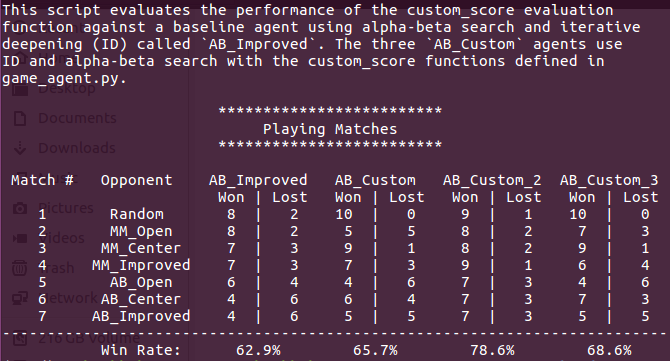
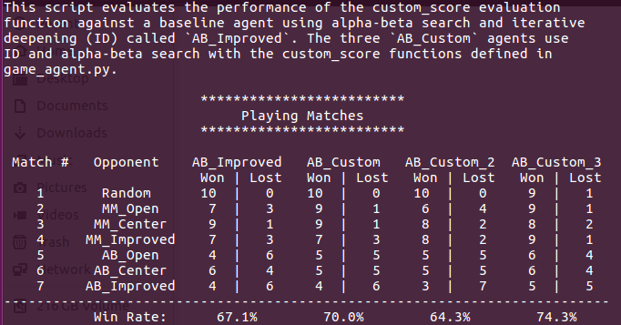
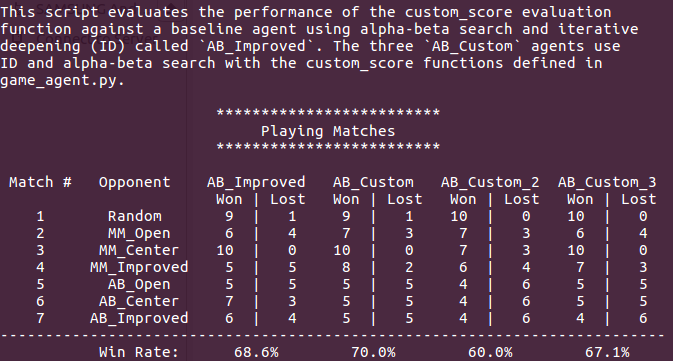
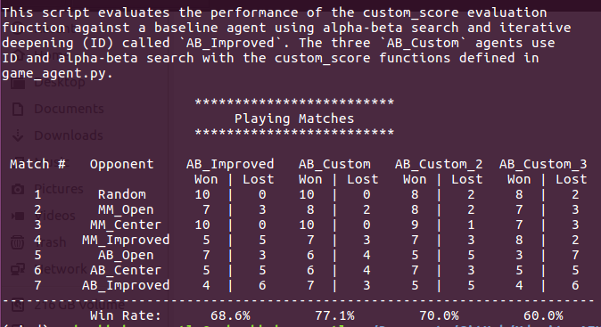

# ***Heuristics Evaluation Review***
### ***Game Isolation***

 

### Heuristic Functions

`moves_ratio`: positively weighted scores if the player has more moves that of opponent and Negatively weighted scores if the opponent has more moves than that of the player.

`weighted_available_moves`: The legal moves available for the current player are weighted based on their position in the board. The moves are weighted proportionally with scores for each move decreasing the farther they are from the center of the board.

i.e. Suppose a move is made at the center of the board it is given a score of 4, a move made at a unit distance away from center of the board it is given a score of 3 and vice-versa.

`weighted_center_board_moves`: This is a slight variation of `weighted_available_moves`. Here, the moves at the center of the board are given a lot more weightage than the moves that are far away from the center of the board.

If the move is at the center of the board it is given a score of 8. And other consecutive moves that are away from the center are given a scores of 5 and downwards.

`improved_score_([0-9]+)_heuristic`: This is a variation of `improved_score` function. Here the no.of available opponent moves are given more weightage (say alpha) than the player's no.of available legal moves.

`improved_score_2_heuristic`: Here I used the same heuristics logic as mentioned above. With the value of `alpha = 1.5`

`improved_score_3_heuristic`: Here I used the same heuristics logic as mentioned above. With the value of `alpha = 2.0`

`improved_score_4_heuristic`: Here I used the same heuristics logic as mentioned above. With the value of `alpha = 2.5`.

### TOURNAMENT - I
-  Custom => `improved_score_heuristic` with alpha = 1.5
-  Custom 2 => `improved_score_heuristic` with alpha = 2.0
-  Custom 3 => `improved_score_heuristic` with alpha = 2.5

From the above tournament I found that `improved_score_heuristic` with `alpha = 2.0` has more win % than 1.5 and 2.5 alpha values.

Hence, I chose to use `improved_score_3_heuristic` as a heuristic function with alpha = 2.0

### TOURNAMENT - II
-  Custom => `moves_ratio`
-  Custom 2 => `weighted_available_moves`
-  Custom 3 => `improved_score_3_heuristic`

### TOURNAMENT - III
-  Custom => `moves_ratio`
-  Custom 2 => `weighted_available_moves`
-  Custom 3 => `weighted_center_board_moves`

### TOURNAMENT - IV
-  Custom => `moves_ratio`
-  Custom 2 => `improved_score_3_heuristic`
-  Custom 3 => `weighted_center_board_moves`

From the above 3 tournaments we can observe that `moves_ratio` has been outperforming all the other 2 heuristic functions consistently in the last 2 tournaments.

Hence, I chose my best heuristic function as `moves_ratio` in my final project submission
